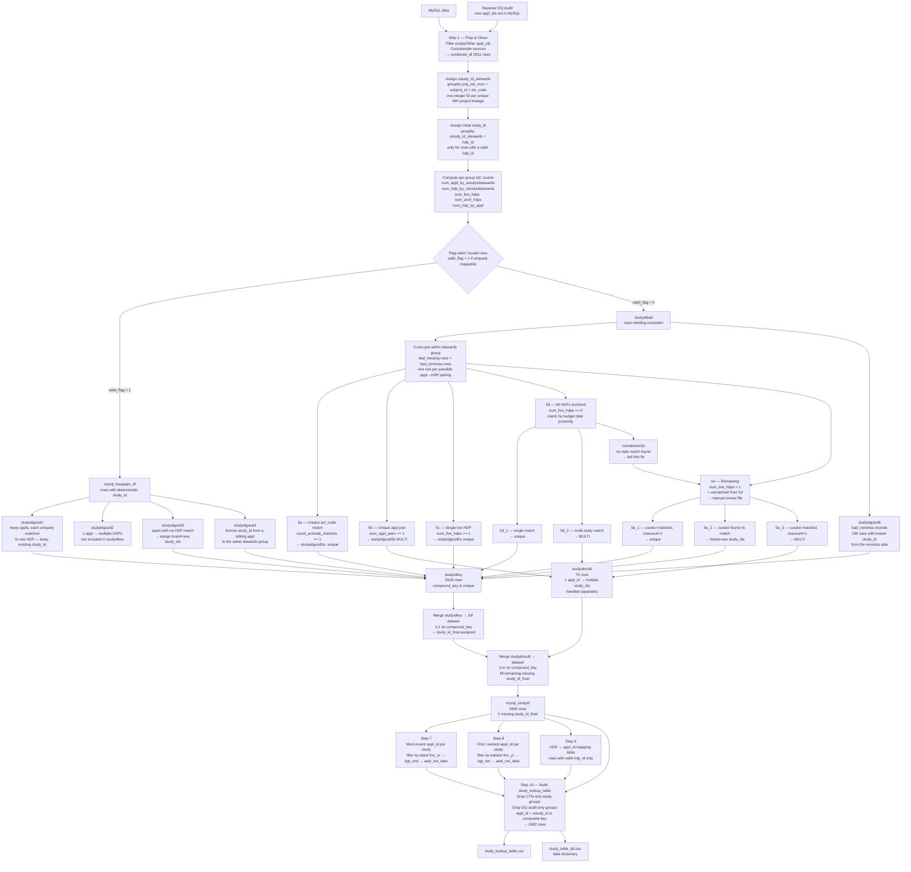

# HEAL_04_StudyTable — Logic Overview

This document describes the study ID assignment algorithm implemented in `HEAL_04_StudyTable.py`.

---

## High-level flow



---

## Key concepts

| Term | Meaning |
|------|---------|
| `xstudy_id_stewards` | Integer ID for a unique NIH project lineage (proj_ser_num + subproj_id + sfx_code). Groups all awards that belong to the same parent grant. |
| `study_id` / `xstudy_id` | The final study identifier. Prefixed with `x` to signal it is volatile and may change on a new run. |
| `compound_key` | `appl_id + "_" + hdp_id` — uniquely identifies a row in the dataset. |
| `hdp_id` | HEAL Data Platform ID. Present only for studies registered on the platform. |
| `studyidbad` | Rows where the appl↔HDP mapping is ambiguous and cannot be resolved automatically. |
| `bad_missing` | Subset of studyidbad where hdp_id is absent. |
| `bad_nonmiss` | Subset of studyidbad where hdp_id is present (renamed with `z` prefix before joining). |
| `studyidmulti` | Appl_ids that genuinely belong to more than one study — included via a separate 1:m merge rather than the 1:1 studyidkey merge. |

---

## studyidbad resolution — decision tree

```
studyidbad
│
├─ 5a  count_actcode_matches == 1 ──────────────────── unique match via act_code
│      AND act_code_match == 1
│
├─ 5b  count_actcode_matches != 1                       appl is latest award for
│      AND num_appl_pairs == 1 ─────────────────────── multiple existing studies → MULTI
│
├─ 5c  count_actcode_matches != 1
│      AND num_appl_pairs != 1
│      AND num_live_hdps == 1 ──────────────────────── unique live HDP → unique match
│      AND zarchived == "live"
│
├─ 5d  count_actcode_matches != 1
│      AND num_appl_pairs != 1
│      AND num_live_hdps == 0                           all HDPs archived
│      ├─ match by min budget date gap
│      │   ├─ rowcount == 1 ──────────────────────── unique match
│      │   ├─ rowcount > 1 AND any_match == 1 ─────── MULTI
│      │   └─ rowcount > 1 AND any_match == 0 ─────── → 5e (nomatches5d)
│      └─ no valid gap found → → 5e
│
└─ 5e  num_live_hdps > 1                               truly ambiguous
       + nomatches5d from 5d                           curated manually
       ├─ rowcount == 1 ────────────────────────────── unique match (curator decision)
       ├─ any_match == 0 ───────────────────────────── no match → brand-new study_id
       └─ rowcount > 1 AND any_match == 1 ──────────── MULTI (curator found multiple)
```
