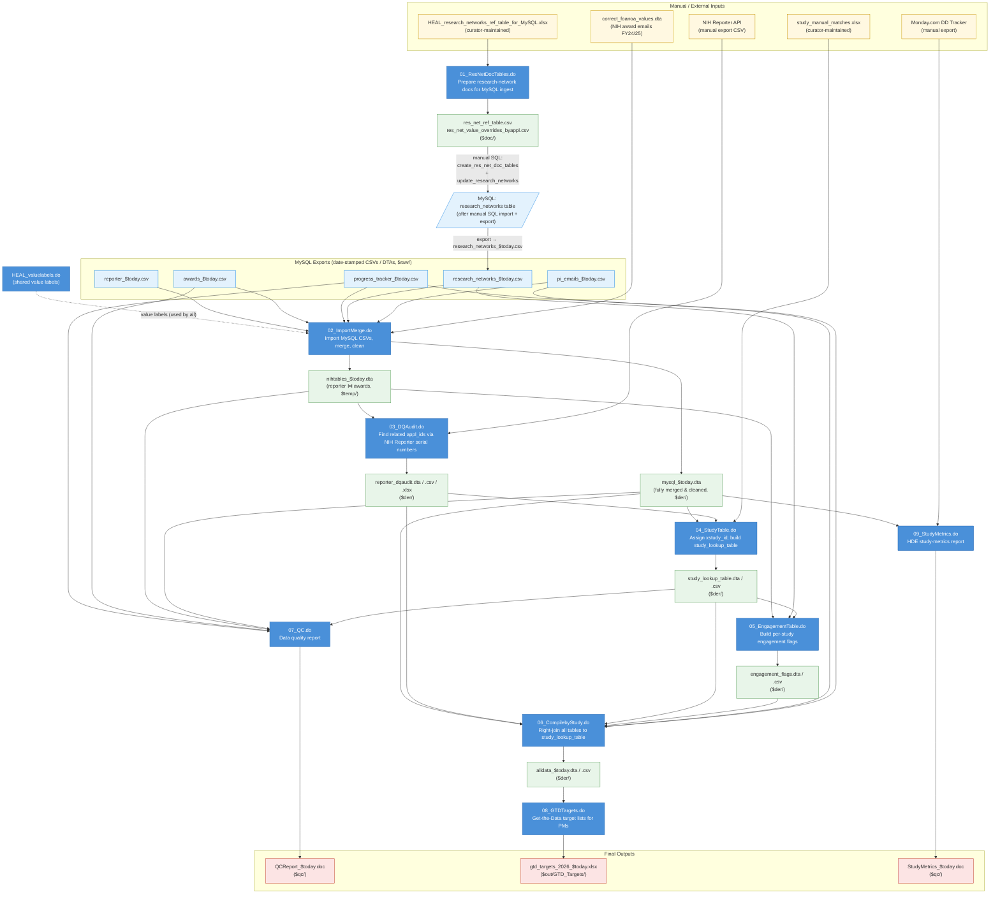

# HEAL Stata Pipeline — Data Flow Diagram

Each numbered script is run sequentially by `HEAL_00_Master.do`.
`HEAL_valuelabels.do` is called once at startup and applies value labels in all downstream scripts.

---

## Script-by-script summary

| Script | Key Inputs | Key Outputs |
|--------|-----------|-------------|
| `HEAL_valuelabels.do` | — | Stata value-label definitions (in-memory, used by all scripts) |
| `HEAL_01_ResNetDocTables.do` | `HEAL_research_networks_ref_table_for_MySQL.xlsx` | `res_net_ref_table.csv`, `res_net_value_overrides_byappl.csv`; triggers manual MySQL SQL run |
| `HEAL_02_ImportMerge.do` | MySQL exports (reporter, awards, progress_tracker, research_networks, pi_emails), `correct_foanoa_values.dta` | `nihtables_$today.dta`, `mysql_$today.dta` |
| `HEAL_03_DQAudit.do` | `nihtables_$today.dta`, NIH Reporter API CSV (manual) | `reporter_dqaudit.dta/.csv/.xlsx` |
| `HEAL_04_StudyTable.do` | `mysql_$today.dta`, `reporter_dqaudit.dta`, `study_manual_matches.xlsx` | `study_lookup_table.dta/.csv` |
| `HEAL_05_EngagementTable.do` | `nihtables_$today.dta`, `research_networks_$today.dta`, `study_lookup_table.dta` | `engagement_flags.dta/.csv` |
| `HEAL_06_CompilebyStudy.do` | `mysql_$today.dta`, `reporter_dqaudit.dta`, `study_lookup_table.dta`, `engagement_flags.dta`, `pi_emails_$today.dta`, `progress_tracker_$today.dta` | `alldata_$today.dta/.csv` |
| `HEAL_07_QC.do` | `progress_tracker_$today.dta`, `awards_$today.dta`, `nihtables_$today.dta`, `mysql_$today.dta`, `study_lookup_table.dta` | `QCReport_$today.doc` |
| `HEAL_08_GTDTargets.do` | `alldata_$today.dta` | `gtd_targets_2026_$today.xlsx` |
| `HEAL_09_StudyMetrics.do` | `mysql_$today.dta`, Monday.com DD Tracker export (manual) | `StudyMetrics_$today.doc` |

### Archived / out-of-tree scripts

| Script | Notes |
|--------|-------|
| `HEAL_96_CTN.do` | One-time run (2024): builds CTN protocol crosswalk from CTN Excel + NIH Reporter API + `mysql_$today.dta`; outputs CTN crosswalk CSV/DTA and CTN `appl_ids` |
| `HEAL_TableArchiving.do` | Manages MySQL table archiving; not part of the regular pipeline |
| `HEAL_scratch.do` | Ad-hoc queries; not part of the regular pipeline |

### Manual steps in the pipeline

1. **Before running 01** — ensure `HEAL_research_networks_ref_table_for_MySQL.xlsx` is up to date.
2. **After 01, before 02** — run the SQL scripts `create_res_net_doc_tables` and `update_research_networks` in MySQL, then export `research_networks` as a date-stamped CSV.
3. **Before 03** — run a manual NIH Reporter API query and save the CSV export to `$raw/`.
4. **Before 09 (optional)** — export the Monday.com Data Dictionary Tracker board and manually reformat it into separate tabs (one per board section) before saving.
